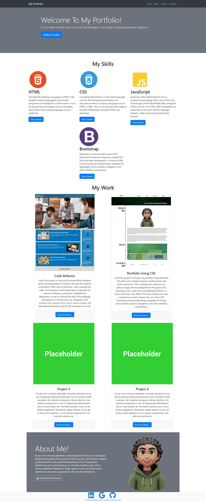

# Module 3 Assignment

# Building a Portfolio With Bootstrap

## Description:

I built this project to display my portfolio using the Bootstrap CSS framework. This has been able to showcase my ability to apply the knowledge learnt throughout the bootcamp into a well-structured deployed website, in only a short time.

## Deployed Link:

https://adammbnitro.github.io/Bootstrap-Portfolio/

## License 

Copyright (c). All rights reserved.

Licensed under the MIT license.